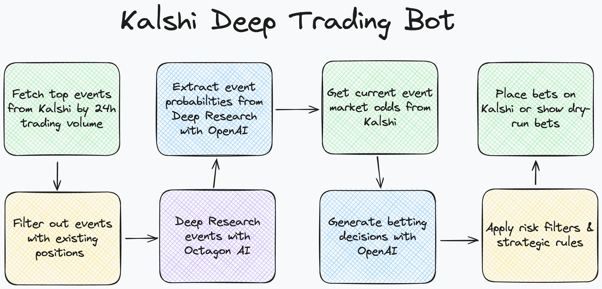
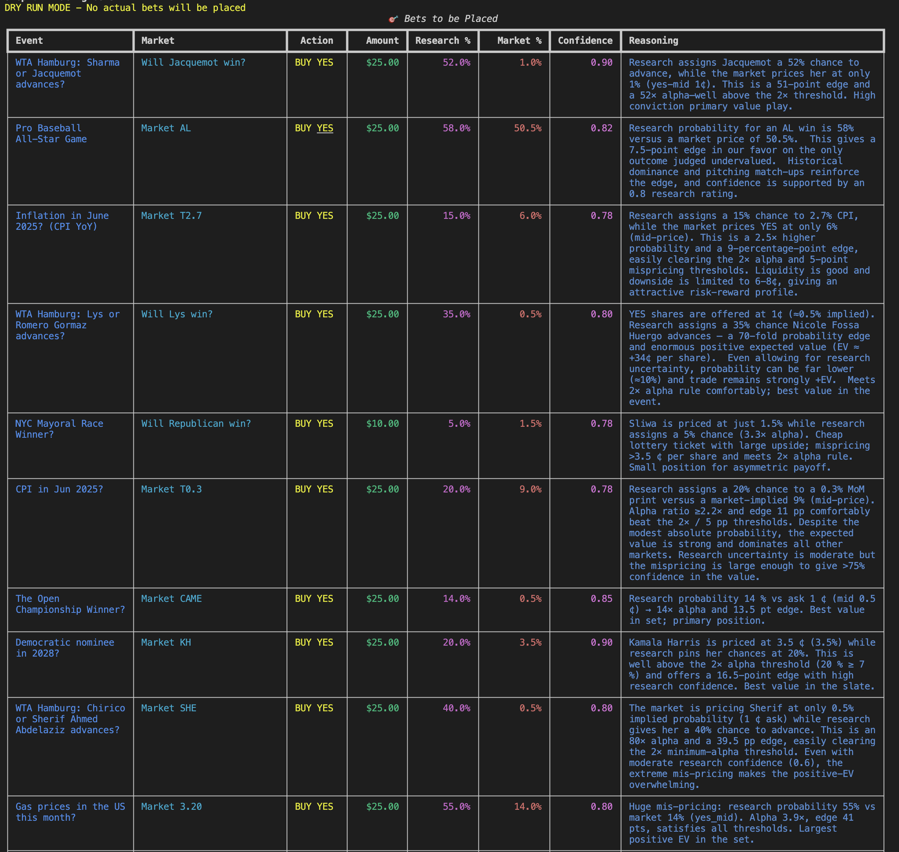

# Kalshi Deep Trading Bot

A straightforward trading bot for Kalshi prediction markets that uses Octagon Deep Research for market analysis and OpenAI for structured betting decisions.





## ⚠️ Financial Disclaimer

**IMPORTANT: This software is provided for educational and research purposes only. Trading prediction markets involves significant financial risk.**

- **No Financial Advice**: This bot does not provide financial advice. All trading decisions are made by automated algorithms and should not be considered investment recommendations.
- **Risk of Loss**: Trading prediction markets can result in substantial financial losses. You may lose some or all of your invested capital.
- **No Liability**: Octagon AI, its affiliates, and contributors are not liable for any trading losses, damages, or other financial consequences resulting from the use of this software.
- **Use at Your Own Risk**: By using this software, you acknowledge that you understand the risks involved and that you are solely responsible for any trading decisions and their outcomes.
- **No Warranty**: This software is provided "as is" without any warranties or guarantees of performance, accuracy, or profitability.

**Please trade responsibly and only with capital you can afford to lose.**

## How It Works

The bot follows a simple 6-step workflow:

1. **Fetch Events**: Gets top 50 events from Kalshi sorted by volume (filtered by status and time)
2. **Process Markets**: Uses top 10 highest volume markets per event
3. **Research Events**: Uses Octagon Deep Research to analyze event + markets (without odds)
4. **Fetch Market Odds**: Gets current bid/ask prices for all markets
5. **Make Decisions**: Feeds research results and market odds into OpenAI for structured betting decisions
6. **Place Bets**: Executes the recommended bets via Kalshi API

## Features

- **Simple & Direct**: No complex strategies or risk management systems
- **AI-Powered**: Uses Octagon Deep Research for market analysis and OpenAI for decision making
- **Event-Based**: Analyzes entire events with all markets for better context
- **Flexible Environment**: Supports both demo and production environments
- **Dry Run Mode**: Test the bot without placing real bets
- **Rich Console**: Beautiful progress tracking and result display with probability predictions

## Quick Start

### 1. Install uv (if not already installed)

```bash
curl -LsSf https://astral.sh/uv/install.sh | sh
```

### 2. Install Dependencies

```bash
uv sync
```

### 3. Set Up Environment

Copy the environment template and fill in your API credentials:

```bash
cp env_template.txt .env
# Edit .env with your API keys
```

Required API keys:
- **Kalshi API**: Get from [kalshi.com](https://docs.kalshi.com/getting_started/api_keys) or [demo.kalshi.co](https://demo.kalshi.co)
- **Octagon API**: Get from [app.octagonai.co](https://app.octagonai.co/signup)
- **OpenAI API**: Get from [platform.openai.com](https://platform.openai.com/api-keys)

### 4. Run the Bot

**Default (Dry Run Mode):**
```bash
# Shows what trades would be made without placing real bets
uv run trading_bot.py
# OR
uv run trading-bot
```

**Live Trading Mode:**
```bash
# Actually places bets (use with caution!)
uv run trading_bot.py --live
# OR
uv run trading-bot --live
```

### Optional: Filter markets by soonest expiration

You can limit markets to those closing within a certain number of hours from now using `--max-expiration-hours` (minimum 1 hour). This converts to the Kalshi API's `max_close_ts` (Unix timestamp) automatically.

```bash
# Only include markets that close within the next 6 hours
uv run trading-bot --max-expiration-hours 6

# Combine with live trading
uv run trading-bot --live --max-expiration-hours 12
```

## Configuration

Key settings in `.env`:

```env
# Environment
KALSHI_USE_DEMO=true          # Use demo environment for testing

# Limits
MAX_EVENTS_TO_ANALYZE=50      # Number of top events to analyze by 24h volume
MAX_BET_AMOUNT=25.0           # Maximum bet per market
RESEARCH_BATCH_SIZE=10        # Number of parallel deep research requests
SKIP_EXISTING_POSITIONS=true # Skip betting on markets where we already have positions

# Risk Management / Hedging
ENABLE_HEDGING=true           # Enable hedging to minimize risk and protect downside
HEDGE_RATIO=0.25              # Default hedge ratio (0.25 = hedge 25% of main bet on opposite side)
MIN_CONFIDENCE_FOR_HEDGING=0.6 # Only hedge bets with confidence below this threshold
MAX_HEDGE_AMOUNT=50.0         # Maximum hedge amount per bet in dollars

# API Keys
KALSHI_API_KEY=your_key
KALSHI_PRIVATE_KEY=your_private_key
OCTAGON_API_KEY=your_key
OPENAI_API_KEY=your_key
```

### Configuration Notes

- **MAX_EVENTS_TO_ANALYZE**: Controls how many of the top events (sorted by 24h volume) to analyze. The bot fetches ALL events from Kalshi, sorts them by trading volume, and processes only the top N most active events.
- **RESEARCH_BATCH_SIZE**: Controls how many deep research requests are sent in parallel. Higher values process faster but may hit rate limits. Recommended range: 1-20.
- **SKIP_EXISTING_POSITIONS**: When enabled (default), the bot will skip betting on markets where you already have positions to avoid duplicate trades.
- **MAX_MARKETS_PER_EVENT**: Controls how many markets per event to analyze (default: 10). For events with many markets, selects the top N markets by volume to keep context manageable.

**Risk Management & Hedging:**
- **ENABLE_HEDGING**: When enabled (default), automatically generates hedge bets to minimize downside risk
- **HEDGE_RATIO**: Proportion of main bet amount to hedge on opposite side (0.25 = 25% hedge)
- **MIN_CONFIDENCE_FOR_HEDGING**: Only hedge bets with confidence below this threshold (0.6 = hedge when confidence < 60%)  
- **MAX_HEDGE_AMOUNT**: Maximum dollar amount per hedge bet to limit hedge costs

### Trading Modes

**Demo vs Production Environment:**
- `KALSHI_USE_DEMO=true`: Uses Kalshi's demo environment with test data and fake money
- `KALSHI_USE_DEMO=false`: Uses Kalshi's production environment with real markets and real money

**Dry Run vs Live Trading:**
- **Default (Dry Run)**: Shows what trades would be made without placing real bets
- **Live Trading (`--live`)**: Actually places bets on the selected environment

**Recommended Testing Flow:**
1. `KALSHI_USE_DEMO=true` + Default (dry run): Test with demo data, no bets placed
2. `KALSHI_USE_DEMO=true` + `--live`: Test with demo data, fake bets placed
3. `KALSHI_USE_DEMO=false` + Default (dry run): Test with real data, no bets placed
4. `KALSHI_USE_DEMO=false` + `--live`: **LIVE TRADING** with real money

## Project Structure

```
├── trading_bot.py          # Main bot execution
├── config.py               # Configuration management
├── kalshi_client.py        # Kalshi API client
├── research_client.py      # Octagon Deep Research client
├── betting_models.py       # Pydantic models for betting decisions
├── pyproject.toml          # uv dependencies and project config
├── env_template.txt        # Environment configuration template
└── README.md              # This file
```

## API Integrations

### Kalshi API
- **Authentication**: RSA signature-based authentication
- **Events**: Fetches top events sorted by volume
- **Markets**: Gets all markets for each event
- **Orders**: Places buy/sell orders for YES/NO positions

### Octagon Deep Research
- **Research**: Analyzes event + markets for sentiment, news, and trading factors
- **Probability Predictions**: Provides independent probability assessments
- **Insights**: Gives actionable trading recommendations
- **Risk Assessment**: Identifies key risk factors for each market

### OpenAI API
- **Structured Output**: Uses GPT-4 for betting decision analysis
- **Decision Making**: Processes research data into actionable bets
- **Risk Management**: Built-in confidence thresholds and position sizing

## Example Output

```
Step 1: Fetching top events...
✓ Found 50 events

Step 2: Fetching markets for 50 events...
✓ Found 247 total markets across 45 events

Step 3: Researching 45 events...
✓ Researched NYC-MAYOR-2025
Predicted probabilities for NYC-MAYOR-2025:
  NYC-MAYOR-ZOHRAN: 71.0%
  NYC-MAYOR-ADAMS: 13.0%
✓ Completed research on 42 events

Step 4: Generating betting decisions...
✓ Generated 34 betting decisions

Step 5: Placing bets...
Bets to be placed:
NYC-MAYOR-ZOHRAN: buy_yes $25.00
  Reasoning: Research shows 71% probability, current market odds undervalue this candidate
  Confidence: 0.85

✓ Placed buy_yes bet on NYC-MAYOR-ZOHRAN for $25.00
  Reasoning: Research shows 71% probability, current market odds undervalue this candidate
✓ Successfully placed 28 bets
✓ Total amount bet: $1,247.50
```

## Safety Features

- **Demo Environment**: Test with mock funds before live trading
- **Dry Run Mode**: Simulate all operations without real money
- **Position Limits**: Configurable maximum bet amounts
- **Confidence Thresholds**: Only bet on high-confidence opportunities
- **Error Handling**: Comprehensive error handling and logging

## Development

### Architecture

The bot uses a simple, linear workflow:
1. `SimpleTradingBot.get_top_events()` - Fetch top events from Kalshi
2. `SimpleTradingBot.get_markets_for_events()` - Get markets for each event
3. `SimpleTradingBot.research_events()` - Research each event with Octagon
4. `SimpleTradingBot.get_betting_decisions()` - Process research with OpenAI
5. `SimpleTradingBot.place_bets()` - Execute bets via Kalshi

### Key Classes

- **SimpleTradingBot**: Main orchestration class
- **KalshiClient**: Kalshi API interface
- **OctagonClient**: Octagon Deep Research interface
- **BettingDecision**: Individual betting decision model
- **MarketAnalysis**: Complete analysis with multiple decisions

### Development Commands

```bash
# Install development dependencies
uv sync --group dev

# Run tests
uv run pytest

# Format code
uv run black .
uv run isort .

# Lint code
uv run flake8 .
```

### Error Handling

The bot handles various error scenarios:
- API rate limits and timeouts
- Market data inconsistencies
- Authentication failures
- Network connectivity issues

## Limitations

- **Event Coverage**: Processes events sequentially to avoid rate limits
- **Research Quality**: Depends on Octagon Deep Research data quality
- **Decision Making**: Relies on OpenAI's analysis capabilities
- **Risk Management**: Basic position sizing and confidence thresholds only

## License

This project is for educational and research purposes. Use at your own risk.

## Support

For issues or questions:
1. Check the error logs for detailed error messages
2. Verify API credentials and rate limits
3. Test with smaller event limits first
4. Use dry run mode for debugging 
